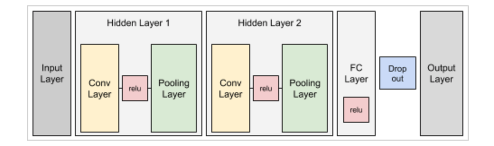
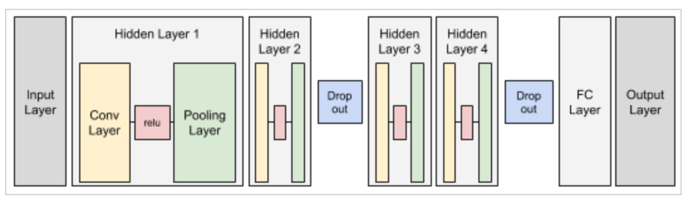

# Performance Improvement of MNIST Classification

- Course: Artificial Intelligence
- Language: Python

---

## Overview

- Goal: Modify the following code to decrease the error rate to 1% about test data.
  - [initial_code.py](./initial_code.py)
  - by [TensorflowDeeplearning - Chapter 05](https://github.com/Jpub/TensorflowDeeplearning/blob/master/Chapter05/MNIST%20double%20layer%20CNN%20classification.ipynb)

- Fixed Condition
  - Filter size = 3x3
  - The count of the Convolutional Layer should be larger than 2.

- [result.ipynb](./result.ipynb)

## Construction of Neural Network

- Before re-constructing
  - Iteration: 2000 --> Accuracy: **97.13%**



- After re-constructing
  - Iteration: 2000 --> Accuracy: **99.14%**



## Description

- Increased the count of the convolutional layer at first, but accuracy hasn't improved as much as I thought.
  - In case of adding a layer, which has the count of filters = 64, 
    - Iteration: 2000 --> Accuracy: **97.85%**

  ``` python
  ...

  # Hidden Layer 3
  W_conv3 = tf.Variable(tf.truncated_normal([3,3,64,128], stddev=0.1))
  h_conv3 = tf.nn.conv2d(h_pool2, W_conv3, strides=[1,1,1,1], padding='SAME')
  b_conv3 = tf.Variable(tf.constant(0.1, shape=[128]))
  h_conv3_cutoff = tf.nn.relu(h_conv3 + b_conv3)
  h_pool3 = tf.nn.max_pool(h_conv3_cutoff, ksize=[1,2,2,1],
                           strides=[1,2,2,1], padding='SAME')

  # Fully Connected Layer
  num_units1 = 4*4*128
  num_units2 = 1024
  h_pool_flat = tf.reshape(h_pool3, [-1, num_units1])

  ...
  ```

  - In case of adding a layer, which has the count of filters = 128,
    - Iteration: 2000 --> Accuracy: **97.94%**

  ``` python
  ...
  
  # Hidden Layer 4
  W_conv4 = tf.Variable(tf.truncated_normal([3,3,128,256], stddev=0.1))
  h_conv4 = tf.nn.conv2d(h_pool3, W_conv4, strides=[1,1,1,1], padding='SAME')
  b_conv4 = tf.Variable(tf.constant(0.1, shape=[256]))
  h_conv4_cutoff = tf.nn.relu(h_conv4 + b_conv4)
  h_pool4 = tf.nn.max_pool(h_conv4_cutoff, ksize=[1,2,2,1],
                           strides=[1,2,2,1], padding='SAME')

  # Fully Connected Layer
  num_units1 = 2*2*256
  num_units2 = 1024
  h_pool_flat = tf.reshape(h_pool4, [-1, num_units1])

  ...
  ```

  - There was little difference since the four.

- Changed the learning rate to 0.001.
  - Iteration: 2000 --> Accuracy: **98.89%**

  ``` python
  train_step = tf.train.AdamOptimizer(0.001).minimize(loss)
  ```

- Reduced the count of nodes in Fully Connected Layer.
  - That's because I thought it needs to make the computation less since CNN extended.
  - Iteration: 2000 --> Accuracy: **98.83%**

  ``` python
  ...
  # Fully Connected Layer
  num_units1 = 7*7*64
  num_units2 = 512 # modified

  h_pool_flat = tf.reshape(h_pool2, [-1, num_units1])
  w2 = tf.Variable(tf.truncated_normal([num_units1, num_units2]))
  b2 = tf.Variable(tf.constant(0.1, shape=[num_units2]))
  FC = tf.nn.relu(tf.matmul(h_pool2_flat, w2) + b2)

  keep_prob = tf.placeholder(tf.float32)
  FC_drop = tf.nn.dropout(FC, keep_prob)

  ...
  ```

- Increased rate of Dropout to 0.7.
  - Although accuracy is less than before, the loss value decreased.
  - Iteration: 2000 --> Accuracy: **98.76%**

  ``` python
  ...

  for i in range(1, 2001):
      batch_xs, batch_ts = mnist.train.next_batch(50)
      sess.run(train_step,feed_dict={x:batch_xs, t:batch_ts, keep_prob:0.5})

  ...
  ```

- Increased the batch size to 100.
  - Iteration: 2000 --> Accuracy: **98.88%**

  ``` python
  ...

  for i in range(1, 2001):
      batch_xs, batch_ts = mnist.train.next_batch(100)

  ...
  ```

- I supposed it was the placement of `Dropout` that contributed greatly to reduce the error rate.
  - Although there's the same condition, it had a large difference in accuracy according to the placement.
  - Especially, in case that the fully connected layer didn't have Dropout, it had higher accuracy. I think that's because the fully connected layer is close to the output layer, so all nodes need to be calculated for classification of features, which got from previous convolutional layers.
  - For this reason, I placed Dropout to the middle of convolutional layers, and before the fully connected layer.
    - Iteration: 2000 --> Accuracy: **99.31%**
