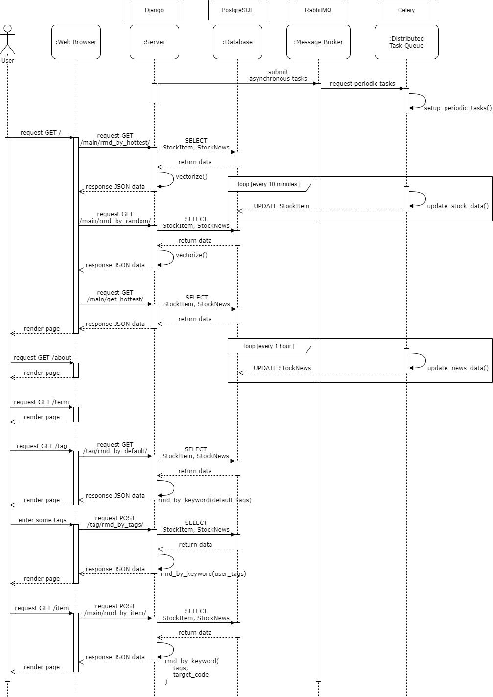
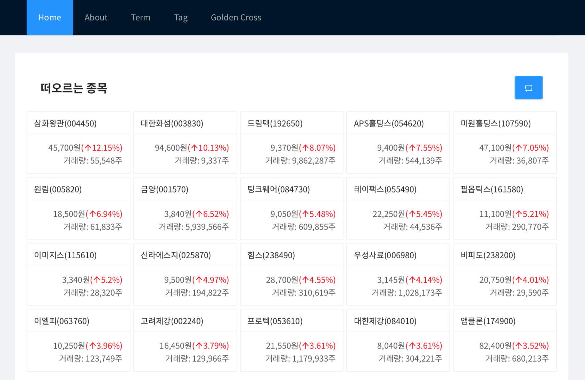
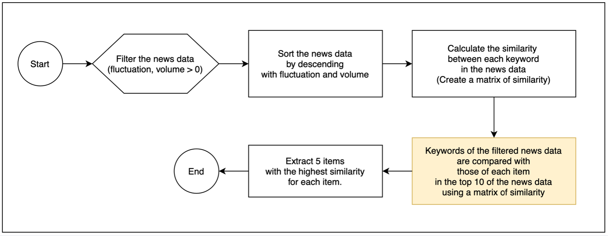
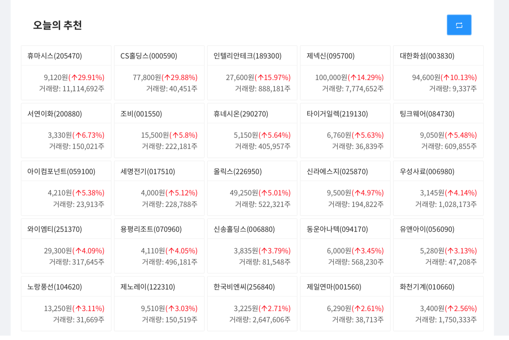
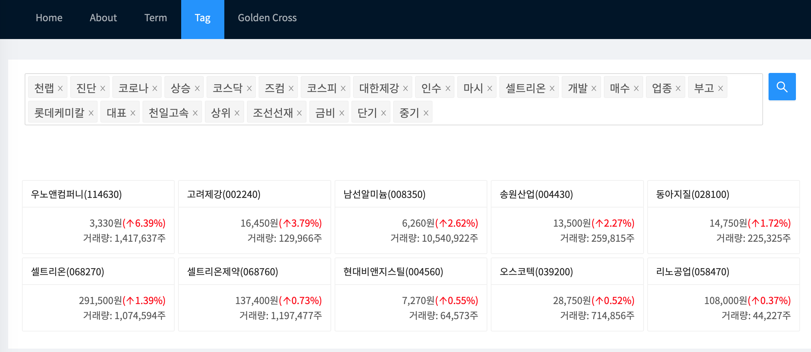
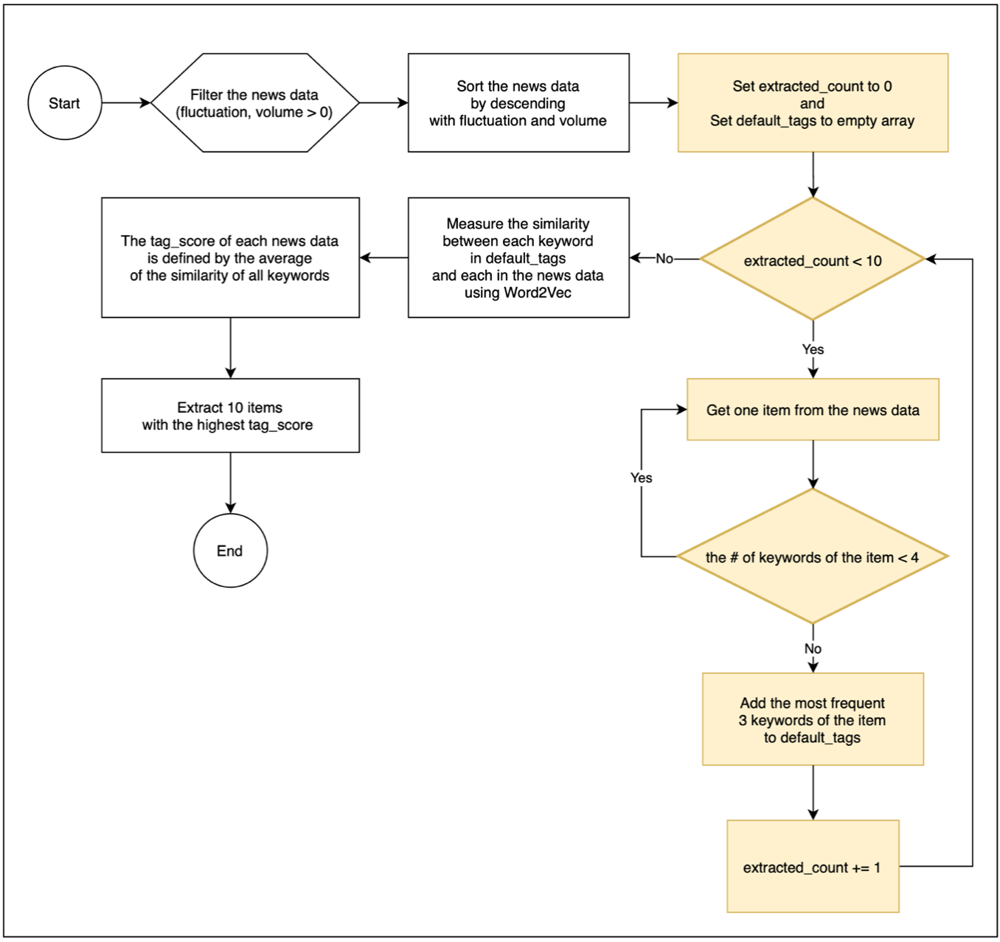
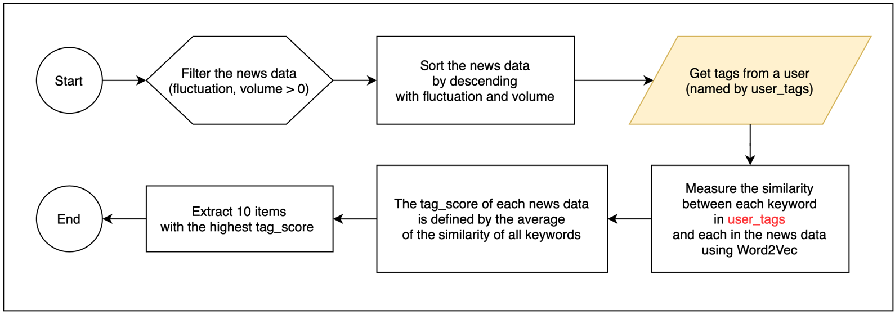

# Capstone Project

## Subject

`Real-time Stock Recommendation System with Machine Learning`

* [`Report`](https://capstone.uos.ac.kr/cdc/index.php/살아서나가자)
  * Only Korean is supported.

## Summary

* It collects news data in real time and analyzes data based on machine learning.
* Using the data analysis results, we recommend events similar to popular ascending stocks.

## Goal

* Aim to provide services that meet the eyes of novice stock investors.
* Create Web sites that include real-time stock recommendation using stock terms, rising stocks, and tags.
* Users can select a stock event to see the details of that stock, and similar items are recommended on that page.

## Detail

* System Design

    

* Sequence Diagram
    

* Tech
  * Morphological Analysis: [`Khaiii`](https://github.com/kakao/khaiii)
  * Word Embedding: [`Word2Vec`](https://radimrehurek.com/gensim/models/word2vec.html)
    * The technology used in this recommendation system is the Word2Vec methodology, and the relevant library is Google's work to demonstrate outstanding performance and high accuracy. The Word2Vec model used by the system learned up to 50 news data for each 2205 stock. However, you may have learned up to 2205 * 50 = 110,250 news data because you did not include articles two months ago. This is the maximum expected number of learning, and we're seeing that you've actually learned about 100,000 news data.

* Recommendation System

  
  * 
  * First Algorithm: The first data filtering is to leave only those stocks with a rate of up and down and above zero, and then sort them based on the rate and volume of up and down. In the resulting data, each keyword calculates a similarity, which returns a matrix of simillarity. The content after the yellow box is to extract the top 10 items, and then select 5 items with the highest similarity for each event and recommend a total of 50 items.

  
  * 
  * Second Algorithm: Only the yellow box parts are different and the rest are the same as the "hot items". The difference from the previous function is how you select the news keyword to compare similarity. Here, we randomly select 10 sports from the top 100 and recommend 5 sports with the highest similarity for each event.

  
  * 
  * Third Algorithm: The yellow box part is where you select the default tag. Initially, we look at keywords one by one from filtered and sorted news data, and only those with more than five keywords are selected as candidates. The reason is that fewer keywords are extracted means fewer news articles and less popular recently. The three most frequent keywords in the selected news data will be added to the default tag, and if this operation is repeated about 10 times, the tag selection will be finished. In this function, we tried to recommend various and popular sports by using Word2Vec by designating keywords that are frequently mentioned in each event as default tags. After the yellow box, the Word2Vec model is used to calculate the tag_score obtained by comparing each item with the default tag. Tag scores are defined as the average of similarity between keywords. And I recommend the top 10 with high average values.

  * 
  * Forth Algorithm: If a user enters a tag, it behaves slightly differently than above, and the difference lies in using the tag that the user entered instead of the default tag as follows.
